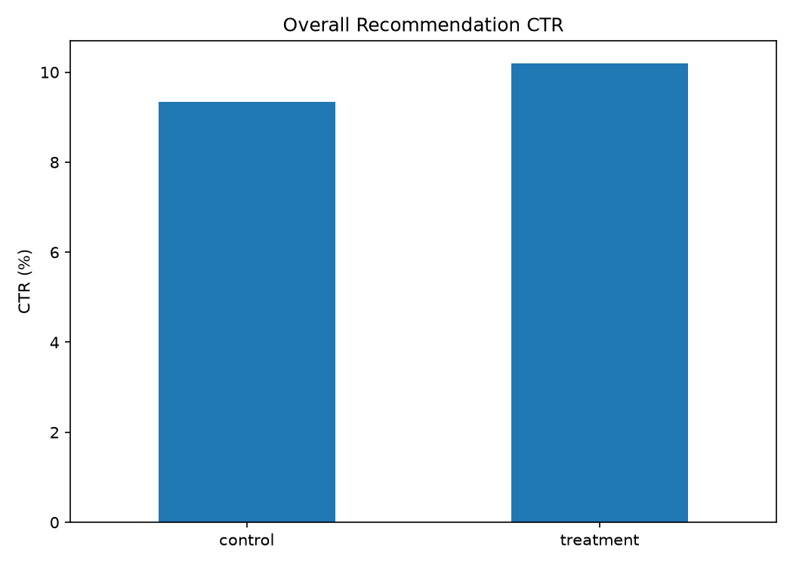
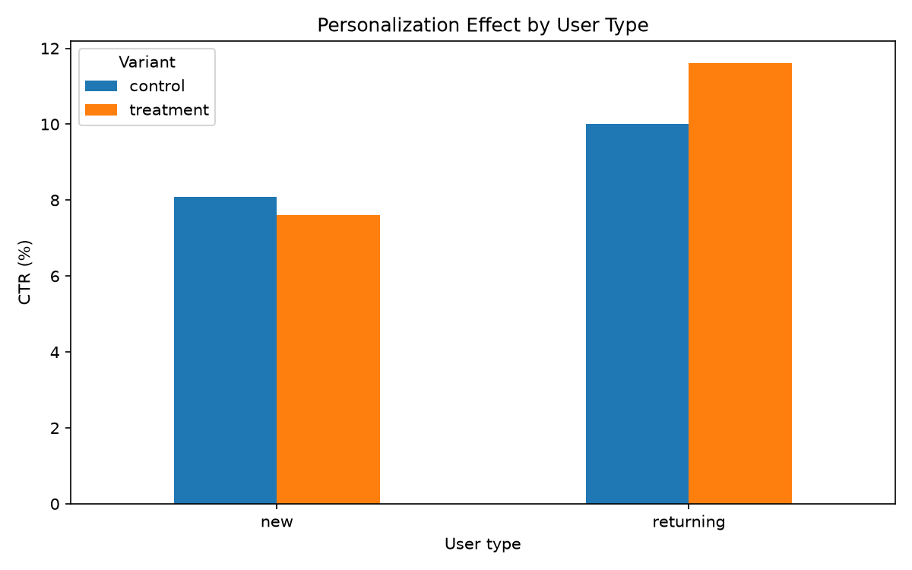
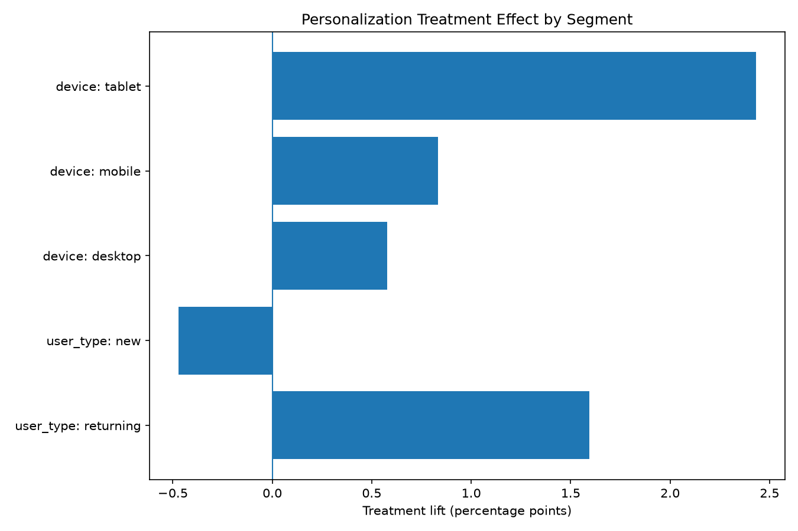
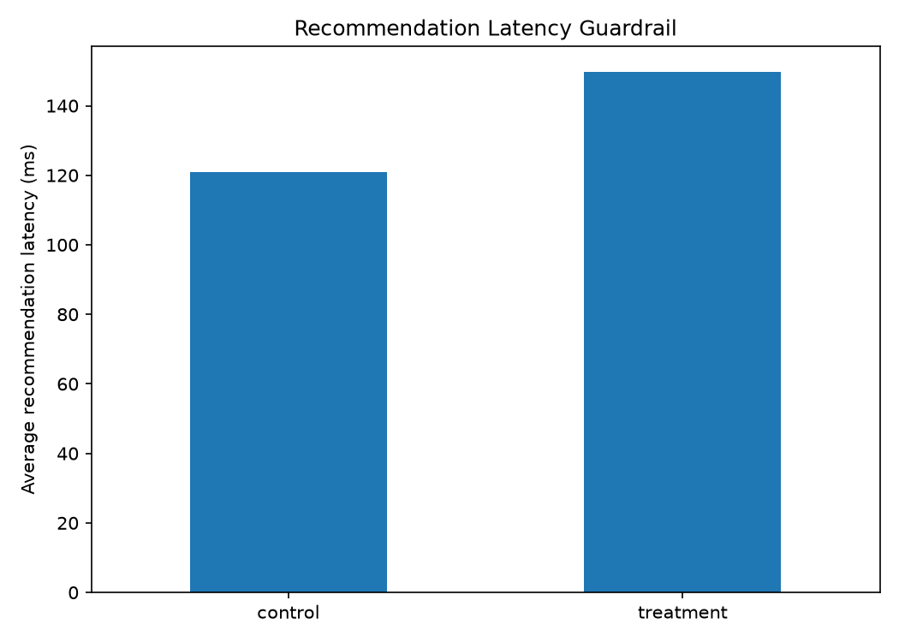
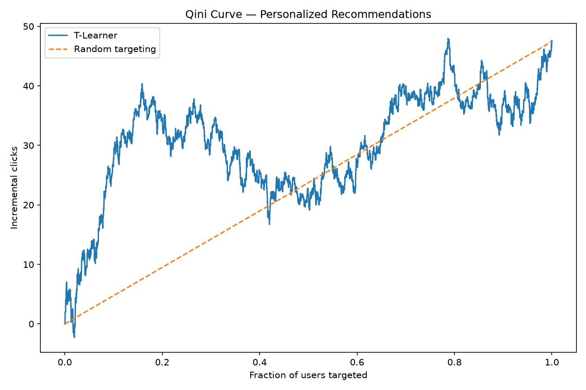

# Movie Recommendation A/B Testing & Uplift Modeling

End-to-end product experimentation project evaluating whether personalized movie recommendations should replace a popularity-based recommendation strategy.

> **Note:** The experiment pipeline is real, but the user population and behavioral outcomes are synthetically generated. This repository does not claim that 28,000 real Netflix users participated in the experiment.

## Overview

Streaming products often have to decide whether a more complex recommendation system creates enough incremental user value to justify rollout. This project evaluates a personalized movie recommender against a popularity-based baseline using randomized experimentation, power analysis, subgroup analysis, interaction testing, and heterogeneous treatment-effect modeling.

The analysis is designed for product managers, data scientists, recommendation teams, and engineers who need to answer not only **“Did personalization work?”**, but also **“For whom did it work, and should we ship it?”**

## Key Results

- **Control CTR:** 9.343%
- **Treatment CTR:** 10.188%
- **Overall lift:** +0.846 percentage points (+9.05% relative)
- **Overall p-value:** 0.0171
- **95% CI:** [+0.150, +1.541] pp
- **Pre-defined business MDE:** +1.00 pp
- **Returning-user lift:** +1.595 pp
- **New-user lift:** -0.472 pp
- **Treatment × returning interaction:** +2.066 pp, p = 0.0037
- **Latency increase:** +27.8 ms
- **Best uplift estimator:** X-Learner by CATE error and ranking quality
- **Final decision:** personalize returning users, keep new users on the popularity baseline, and do not use individual-level uplift targeting yet

## Business Problem

The product decision is whether personalized recommendations create enough incremental engagement to justify replacing a simpler popularity-based recommendation strategy.

**Control:** popular / trending movie recommendations.

**Treatment:** personalized recommendations based on user history and characteristics.

The primary causal question is:

> **Does personalization cause users to click recommendations more often?**

A full rollout should not be based on statistical significance alone. The treatment must also deliver meaningful business lift, avoid unacceptable system-performance costs, and be evaluated for important user segments.

## Dataset

**Source:** Synthetic experiment generated inside this repository  
**Users:** 28,000  
**Experimental unit:** One user  
**Allocation:** Approximately 50% control / 50% treatment  
**Primary outcome:** Recommendation click  
**Secondary outcome:** Watchlist add  
**Guardrail:** Recommendation latency

Important pre-treatment features include:

- user type: new vs returning
- device: mobile, desktop, tablet
- engagement level
- preferred genre
- account age
- previous sessions
- movies previously rated
- average session duration

The simulation also stores hidden potential-outcome probabilities in <code>simulation_truth.csv</code>. These values are used only to evaluate CATE estimators and are never provided to the treatment-effect models during training.

## Project Flow

~~~mermaid
flowchart LR
    A[Generate Users] --> B[Randomize]
    B --> C[Validate SRM & Balance]
    C --> D[Simulate Outcomes]
    D --> E[Power + A/B Test]
    E --> F[Segments & Interaction]
    F --> G[T-Learner / X-Learner]
    G --> H[Business Decision]
~~~

## Exploratory Analysis & Experiment Validation

For an experiment, the first job is not model training. It is validating that the experiment can support a causal interpretation.

### Randomization bug discovered

An early version reused the same deterministic random seed for both population generation and treatment assignment. This accidentally made treatment strongly dependent on user type:

| Group | New | Returning |
|---|---:|---:|
| Control | 71% | 29% |
| Treatment | 0% | 100% |

Treatment users also had much longer account histories and more prior activity. Any treatment effect estimated under that assignment would have been confounded.

The assignment RNG was separated from the population-generation RNG and the experiment was rerun.

After correction, the groups were well balanced. Example standardized mean differences:

| Variable | \|SMD\| |
|---|---:|
| Account age | 0.0010 |
| Previous sessions | 0.0189 |
| Movies rated | 0.0065 |
| Average session duration | 0.0136 |

All were far below the common 0.10 balance threshold.

### Sample Ratio Mismatch

The intended allocation was 50/50. SRM was checked with a chi-square goodness-of-fit test.

An earlier validation run produced:

- Control: 9,990
- Treatment: 10,010
- p-value: 0.8875

There was no evidence of sample-ratio mismatch.

## Methodology

The analysis follows an experimentation-first workflow rather than a standard predictive-ML pipeline:

1. Generate pre-treatment user characteristics.
2. Randomize users into control and treatment.
3. Validate duplicates, missing values, SRM, and covariate balance.
4. Simulate click, watchlist, and latency outcomes.
5. Run prospective power analysis.
6. Estimate the overall A/B treatment effect.
7. Compare statistical significance with practical significance.
8. Analyze predefined user and device segments with multiple-testing correction.
9. Test treatment-effect heterogeneity with an interaction model.
10. Estimate individual-level treatment effects with T-Learner and X-Learner models.
11. Evaluate uplift ranking with Qini, Uplift@K, and known simulation truth.
12. Convert the evidence into a product rollout decision.

## Data Preprocessing

Traditional heavy preprocessing was intentionally limited because the core experiment is randomized.

For experiment analysis:

- duplicate and missing-value checks are performed
- SRM is tested
- categorical covariate balance is checked with chi-square tests and Cramér's V
- numeric covariate balance is checked with standardized mean differences

For uplift modeling:

- categorical variables are one-hot encoded
- numeric variables are standardized
- treatment and control outcome models are trained separately
- a 70/30 train/test split is used with treatment stratification

The treatment-effect models only use pre-treatment user characteristics.

## Baseline: Overall A/B Test

The baseline estimator is the randomized treatment-control difference in recommendation CTR.

| Metric | Control | Treatment |
|---|---:|---:|
| Users | 14,043 | 13,957 |
| CTR | 9.343% | 10.188% |

**Absolute lift:** +0.846 pp  
**Relative lift:** +9.05%  
**Z-statistic:** 2.3837  
**p-value:** 0.0171  
**95% CI:** [+0.150, +1.541] pp

The result is statistically significant at α = 0.05.

The pre-defined minimum practically meaningful effect was +1.00 pp. The point estimate is below that threshold, but the confidence interval still includes effects above +1.00 pp. Therefore the overall experiment is statistically positive, while the size of the practically meaningful effect remains uncertain.

## Power Analysis

The experiment was designed around:

- baseline CTR ≈ 8.98%
- MDE = +1.00 percentage point
- α = 0.05
- power = 80%
- two-sided test

Required sample size:

- **13,461 users per group**
- **26,922 users total**

The first simulated run had only 20,000 users and was underpowered for the pre-specified effect. The experiment was extended to 28,000 users before the final analysis.

## Segment & Interaction Analysis

### Returning users

- Control CTR: 10.015%
- Treatment CTR: 11.610%
- Absolute lift: **+1.595 pp**
- Relative lift: +15.9%
- Holm-adjusted p-value: **0.0027**

This effect exceeds the +1.00 pp business threshold.

### New users

- Control CTR: 8.079%
- Treatment CTR: 7.607%
- Absolute lift: **-0.472 pp**
- Holm-adjusted p-value: **0.6449**

There is no evidence that personalization improves CTR for new users. A plausible product explanation is cold start: new users have little behavioral history available for personalization.

### Treatment × user-type interaction

Separate significant and non-significant subgroup results do not prove that treatment effects differ. An interaction model was therefore estimated:

~~~text
clicked ~ treatment + returning + treatment:returning
~~~

The treatment × returning interaction was:

- **+2.066 pp**
- 95% CI: [+0.671, +3.461] pp
- p-value: **0.0037**

This provides direct evidence that personalization has a larger causal effect for returning users than for new users.

## Guardrail Metric: Recommendation Latency

Personalization improves recommendations at an additional computation cost.

- Control latency: 121.3 ms
- Treatment latency: 149.1 ms
- Increase: **+27.8 ms**
- Decision threshold used in the final policy: +40 ms

The guardrail passes, but the latency cost is still explicitly considered in the rollout decision.

## Uplift Modeling

The average treatment effect does not imply that every user benefits equally. The project therefore estimates:

~~~text
CATE(x) =
P(click | treatment, X)
-
P(click | control, X)
~~~

Two meta-learners were evaluated.

### T-Learner

Two separate gradient-boosting outcome models estimate click probability under control and treatment.

| Metric | T-Learner |
|---|---:|
| CATE MAE | 4.004 pp |
| Pearson correlation | 0.212 |
| Spearman correlation | 0.184 |
| Uplift@10% | 6.373 pp |
| Uplift@20% | 4.212 pp |
| Uplift@30% | 2.554 pp |

The model finds useful high-uplift groups, but individual CATE estimates are noisy.

### X-Learner

The X-Learner first estimates potential outcomes, imputes treatment effects, and then learns separate treatment-effect functions. Because treatment assignment is randomized 50/50, the implementation uses a known propensity of 0.50.

| Metric | X-Learner |
|---|---:|
| CATE MAE | **2.640 pp** |
| Pearson correlation | **0.338** |
| Spearman correlation | **0.281** |
| Uplift@10% | 3.759 pp |
| Uplift@20% | 2.380 pp |
| Uplift@30% | 1.884 pp |

The X-Learner provides better CATE estimation accuracy and ranking quality, even though the T-Learner shows larger observed Uplift@K on this noisy holdout sample.

## Final Model / Estimator Choice

The X-Learner is the stronger heterogeneous-treatment-effect estimator in this experiment because it has:

- lower CATE MAE
- higher Pearson correlation with true simulated uplift
- higher Spearman ranking correlation

However, it is **not promoted to production targeting logic**. A Spearman correlation of 0.281 and CATE MAE of 2.640 pp are not strong enough to justify individualized treatment decisions.

The uplift model is therefore used as a research and monitoring tool, not as the primary rollout mechanism.

## Error Analysis

The main failure modes and weak points are:

1. **Cold start for new users.** Personalization relies on historical interaction data, so new users have less signal and show no measurable treatment benefit.
2. **Noisy individual CATE ranking.** Both meta-learners recover some heterogeneity, but individual treatment-effect estimates are not accurate enough for production targeting.
3. **Observed Uplift@K is noisy.** A model can show strong realized uplift in a small top-ranked group without having the best overall CATE calibration.
4. **Simulation-to-reality gap.** Heterogeneous effects are intentionally encoded in synthetic outcomes, so external validity must not be overstated.
5. **Randomization implementation risk.** The early seed-reuse bug demonstrated that assignment logic itself must be validated before outcome analysis.

## Key Insights

1. Statistical significance alone did not justify a full rollout.
2. Treatment value was concentrated among returning users.
3. New users showed no evidence of benefit, consistent with a cold-start mechanism.
4. The treatment × returning interaction confirmed that the segment difference was real rather than inferred from separate p-values.
5. Personalized recommendations added measurable latency, so engagement and system cost had to be evaluated together.
6. X-Learner improved heterogeneous-effect estimation but remained too noisy for individual targeting.

## Business Recommendation

### Do not roll personalization out to everyone

The overall +0.846 pp CTR point estimate is statistically significant but below the pre-defined +1.00 pp business threshold.

### Roll personalization out to returning users

Returning users showed a +1.595 pp lift with a significant adjusted p-value, and the treatment × returning interaction confirmed stronger treatment response in this group.

### Keep new users on the popularity-based recommender

New users showed -0.472 pp lift with no statistically significant benefit.

### Do not use individual ML targeting yet

The X-Learner is directionally useful but not sufficiently accurate for user-level production decisions.

~~~text
User arrives
     |
New or returning?
   /           \
 New         Returning
  |              |
Popularity    Personalized
recommender   recommender
~~~

## System Architecture

~~~mermaid
flowchart TD
    A[Synthetic User Generator] --> B[Experiment Assignment]
    B --> C[SRM & Balance Validation]
    C --> D[Behavior Simulation]
    D --> E[Experiment Outcomes]
    E --> F[A/B + Power Analysis]
    E --> G[Segment + Interaction Analysis]
    E --> H[T-Learner / X-Learner]
    F --> I[Final Decision Logic]
    G --> I
    H --> I
    I --> J[Streamlit Results App]
~~~

## Project Structure

~~~text
ab-testing-movie-app/
│
├── simulation/
│   ├── generate_users.py
│   ├── assign_experiment.py
│   ├── validate_experiment.py
│   ├── simulate_behavior.py
│   │
│   └── data/
│       ├── synthetic_users.csv
│       ├── experiment_users.csv
│       ├── experiment_outcomes.csv
│       └── simulation_truth.csv
│
├── analysis/
│   ├── power_analysis.py
│   ├── ab_test_analysis.py
│   ├── segment_analysis.py
│   ├── interaction_analysis.py
│   │
│   ├── uplift_modeling.py
│   ├── x_learner.py
│   ├── evaluate_uplift.py
│   ├── model_comparison.py
│   │
│   ├── final_decision.py
│   ├── create_charts.py
│   │
│   └── outputs/
│       ├── charts/
│       ├── uplift_predictions.csv
│       ├── x_learner_predictions.csv
│       └── supporting uplift evaluation files
│
├── app.py
├── requirements.txt
├── README.md
└── .gitignore
~~~

## Technologies

- Python
- NumPy
- Pandas
- SciPy
- Statsmodels
- Scikit-learn
- Matplotlib
- Streamlit

## How to Run

Clone the repository:

~~~bash
git clone https://github.com/htoor2026/ab-testing-movie-app.git
cd ab-testing-movie-app
~~~

Create the environment:

~~~bash
conda create -n ab-testing python=3.11 -y
conda activate ab-testing
~~~

Install dependencies:

~~~bash
pip install -r requirements.txt
~~~

Run the experiment pipeline:

~~~bash
python simulation/generate_users.py
python simulation/assign_experiment.py
python simulation/validate_experiment.py
python simulation/simulate_behavior.py

python analysis/power_analysis.py
python analysis/ab_test_analysis.py
python analysis/segment_analysis.py
python analysis/interaction_analysis.py
python analysis/uplift_modeling.py
python analysis/evaluate_uplift.py
python analysis/x_learner.py
python analysis/model_comparison.py
python analysis/final_decision.py
python analysis/create_charts.py
~~~

Run the Streamlit application:

~~~bash
streamlit run app.py
~~~

## Limitations

- Users and outcomes are synthetic rather than real production traffic.
- Returning/new-user heterogeneity was intentionally encoded to test whether the analysis pipeline could recover meaningful differences.
- The treatment represents the behavioral effect of a personalized recommender; a real recommendation model is not connected to the treatment arm.
- Individual CATE estimates remain noisy.
- Revenue impact is not modeled.
- Real-world interference, logging failures, novelty effects, and long-term retention effects are not captured.

## What I Would Do in Production

A production extension would:

- connect the treatment arm to a real collaborative-filtering or embedding-based recommender
- use a production experimentation platform for deterministic assignment and exposure logging
- automate SRM and covariate-balance alerts
- define experiment metrics and stopping rules before launch
- monitor CTR, watchlist rate, latency, errors, and downstream retention
- use CUPED or other variance-reduction methods where appropriate
- add sequential-testing support for valid interim monitoring
- collect more randomized data before individualized uplift targeting
- calibrate and monitor CATE models over time
- add CI/CD and automated tests for experiment-assignment logic
- monitor recommendation quality and feature drift

## Future Improvements

- Connect MovieLens or another real recommendation dataset
- Implement a real popularity baseline and personalized recommender
- Compare causal forests and doubly robust learners
- Add CUPED variance reduction
- Add sequential experimentation
- Improve CATE calibration and uncertainty estimation
- Integrate an experimentation platform such as GrowthBook
- Add real telemetry and production monitoring

## Author

**Harkamal Toor**

[LinkedIn](https://www.linkedin.com/in/harkamal-s/) · [GitHub](https://github.com/htoor2026)
